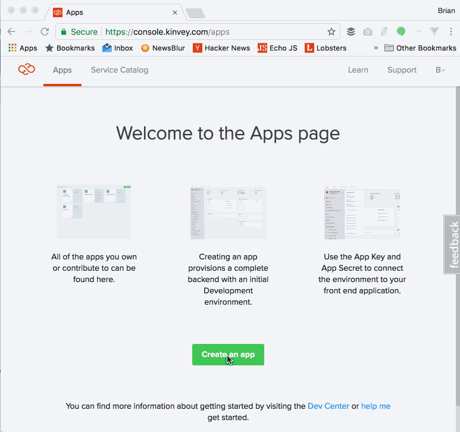
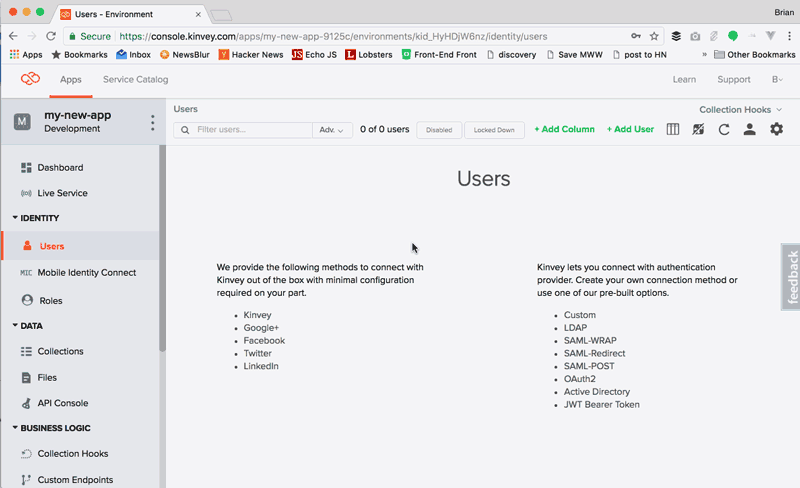
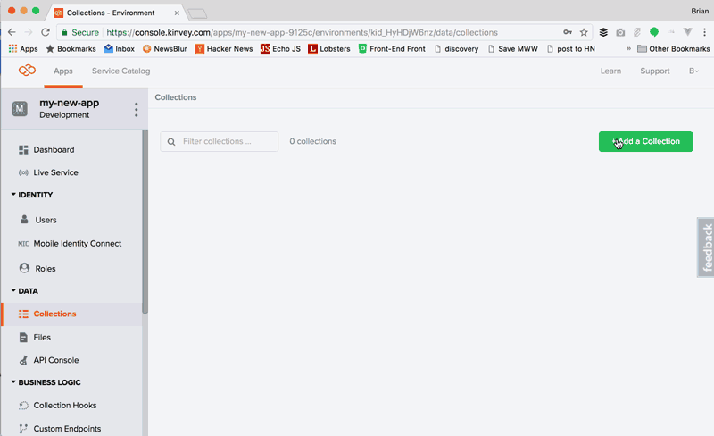
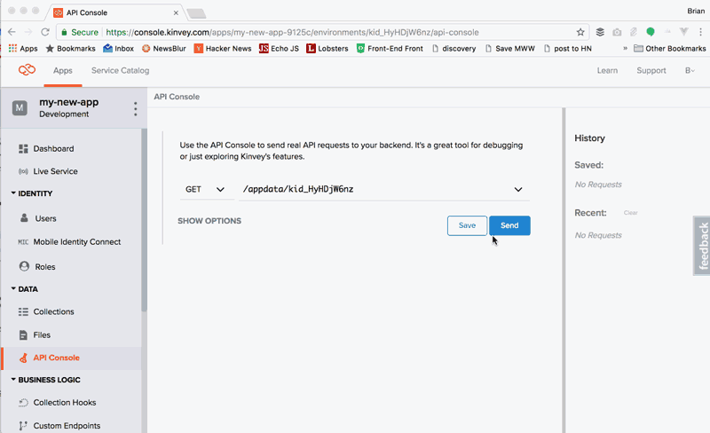
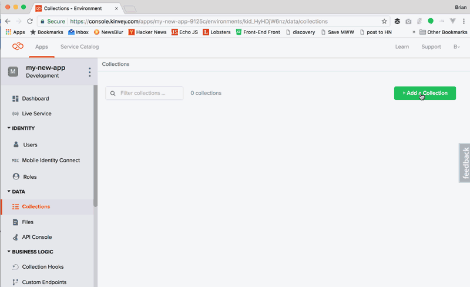
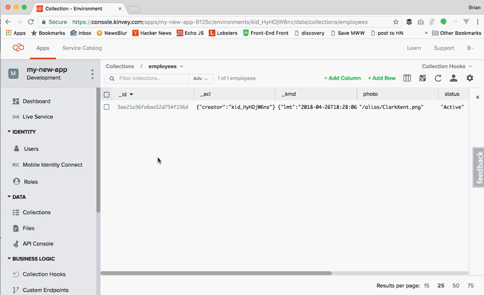
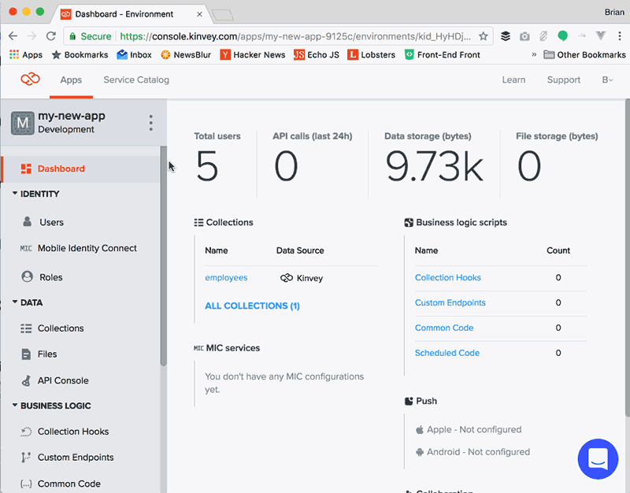

# Kinvey Getting Started Guide

Thanks for giving Kinvey a try! I wanted to take this opportunity to help you get familiar with some of the key features in Kinvey and how to use them in your application.

I should take a moment to note that, during the portions of this guide that discuss actual application code, we'll be using the HTML5 version of the Kinvey SDK, but most of what we'll discuss today will work almost identically across other versions of the SDK. Plus, everything we discuss with regard to Kinvey's web interface (which we refer to as the Kinvey console) will remain applicable, regardless of which SDKs you choose to use.

Let's get started!

## Getting Comfortable with the Console

When you're not writing code to work with Kinvey services, much of your interaction with Kinvey will come via the [web console](https://console.kinvey.com/), so let's take a few minutes to explore what is there.

I'll assume that you've already [created an account](https://console.kinvey.com/signup). After that, the first thing that you'll want to do is to [create an app](https://console.kinvey.com/apps). A Kinvey app is essentially a container for all the Kinvey services that you'll use across the application you are building.

From the [apps page](https://console.kinvey.com/apps), click on "Create an app" button. Give the app a name and then click "Create app."



Now that we've created our app, let's explore some of the key sections you'll want to explore.

### Users

Practically every application needs some form of authentication. Kinvey provides a number of ways to handle authentication and the users section of the Kinvey console is where you'll manage most of it.

The console allows you to manually create users or add columns of data to the users table. In most cases, however, you'll use the console for managing existing users that are registered via your application code. You can manage things like adding [roles](https://devcenter.kinvey.com/rest/guides/roles) to a user (assuming you've set some up), resetting their password or delete the user entirely. All of these features are also available to your application as well via the SDKs or REST API.



If you are looking to integrate your application's authentication with an existing enterprise authentication or social identity solution, you'll want to explore [Mobile Identity Connect](https://devcenter.kinvey.com/html5/guides/mobile-identity-connect).

We'll talk more about users in the "Managing Users in Kinvey" section of this guide.

### Collections

In simple terms, collections represent the data for your application - they are your cloud data store. However, Kinvey offers a ton of additional features that can make them much more than just a simple data store.

Within the Kinvey web console, we can create collections - think of these as similar to a table in a database. We can also manually add columns to the collection, add or modify the data as well as manage the various settings related to this collection. Again, most of these features are also available via code using the SDKs or REST API.



Collections can be tied to external data source, whether they are REST APIs, SQL databases, Salesforce or a variety of other third-party data sources. If you are interested in those features, be sure to learn more about Kinvey features like [RapidData](https://devcenter.kinvey.com/html5/guides/rapid-data) and [FlexServices](https://devcenter.kinvey.com/html5/guides/flex-services).

### API Console

The last thing that we'll take a look at here is the API console, which can be a useful tool when you want to test your Kinvey services and see what the results would look like.

The API console essentially uses the REST API to make GET, POST, PUT or DELETE requests against any of the services you've set up in Kinvey including things like users, collections or custom endpoints. It also offers options for changing the type of authentication used with the request as well as modify the headers. It'll even remember your recent requests and allow you to easily click and rerun them.




This is a handy tool when you want to run quick tests of services before diving into the code.

### Much More

Obviously we've only gone through the very basics of the Kinvey web console, but hopefully this gives you what you need to start exploring and dig deeper.

## Creating and Using a Collection

As I discussed in the previous tutorial, a Kinvey collection is, in simple terms, a cloud data store. But a Kinvey collection is much more powerful as, for example, it can be connected to remote data via a REST API or via an enterprise data source such as Microsoft SQL Server. However, in this tutorial lets just cover the basics of creating and using a collection to get ourselves more comfortable with how they work.

Let's start by creating a new collection called "employees" that will contain our data. Click the "Add a collection" button, enter the name "employees" and click "Save". Once the collection is created, you'll see a bunch of settings for the collection - let's not worry about those right now. Instead, let's add some columns and some data manually.

Click on the collection name (i.e. "employees") in the breadcrumbs links near the top of the page. Click the "Add Column" button and then click into the dialog box and enter the column name "name". Repeat this for three more columns: "founder"; "status"; and "photo".

Now let's manually add some data. Click on the "Add Row" button, then click into the row and add some data for "name", "founder" "status" and "photo" - the particulars of the data you enter don't matter right now.



As you may have noticed, while this works, this isn't a very efficient way of of entering data. Typically, you'd enter data via code or, alternatively, import it. Let's remove this data and import some new data. To delete the row, click the checkbox in the leftmost column of the data grid and then press the "Delete" button in the options that appear to the right. Next, click on the settings icon (the gear in the upper-right-hand corner) then choose the "Import" menu item. Select the file and click "Import". (NOTE: you can [download the file here](LINK_TBD).)



Finally, now that we have some data, let's write some code to query it. The code I will be using for these examples is written in JavaScript so that we can run these easily in the browser, but keep in mind that the various SDKs generally have compatible APIs. So regardless of what SDK you are using, your code should remain similar.

Assuming our page has imported the [HTML5 SDK from the CDN](https://devcenter.kinvey.com/html5/downloads), the first thing we need to do is establish our connection to Kinvey. Let's look at the code to do this.

```javascript
const client = Kinvey.init({
  appKey: 'kid_HyHDjW6nz',
  appSecret: '5dad0a434cbf40549ff926c577403e54'
});
```
You may be wondering, where do I get the values for `appKey` and `appSecret`? You can find these in the console by clicking next to the app name in the upper left corner of the screen.



Kinvey has the concept of an "active user," which is the user that is authenticated to access the data and other information on the Kinvey app. This can be an anonymous user, which is what we'll use for our sample.

Start by getting the active user. This will be empty if one hasn't been established yet.

```javascript
const activeUser = Kinvey.User.getActiveUser(client);
```

Now let's check if the user exists and, if not, establish an anonymous active user with Kinvey. Once this is done, we'll call the `loadDataStore()` method that will pull the data from the collection.

```javascript
if (!activeUser) {
  Kinvey.User.signup()
    .then(() => {
      loadDataStore();
    })
    .catch((error) => {
      console.log(error);
    });
} else {
  loadDataStore();
}
```

I should note that we're using an anonymous user here for the sake of simplicity of the example, but, for your web app, we suggest creating a generic user with default permissions in this scenario.

Now that we have the user, let's take a look at the `loadDataStore()` function that gets the data.

```javascript
function loadDataStore() {
  const dataStore = Kinvey.DataStore.collection('employees');
  const stream = dataStore.find();
  stream.subscribe(
    (employees) => {
      console.log('data retrieved');
      const el = document.getElementById('allEmployees');
      el.innerHTML = '';
      employees.forEach((employee) => {
        el.innerHTML += `
          <li>
            
            <h3>${employee.name}</h3>
            <p>Status: ${employee.status}</p>
          </li>`;
      });
    },
    (error) => {
      console.log(error);
    }
  );
}
```

There's a lot going on here, but the key elements to understand are that the `dataStore` variable in the sample establishes the connection to the `employees` collection in Kinvey. Calling the `find()` method with no parameters will retrieve all of the records - well, technically the first ten thousand entities or 100 MB of data, but in our case that restriction doesn't apply. The `find()` method uses the observable pattern, so we'll subscribe to the `next` method within this observable to stream the data and the `error` method in case something goes wrong. When the `next` method is called, we're just looping through the records returned and outputting the data to the browser via a HTML template.

Let's look at the result.

<script async src="//jsfiddle.net/remotesynth/29nnhjke/embed/"></script>

## Testing with the API Console


## Connecting to External Data Sources with RapidData


## Managing Users in Kinvey


## Connecting to External Authentication sources with Mobile Identity Connect